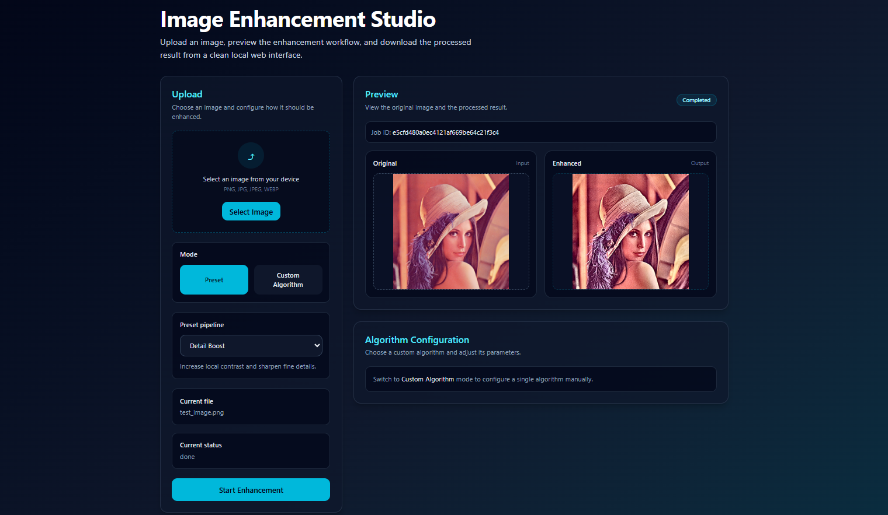
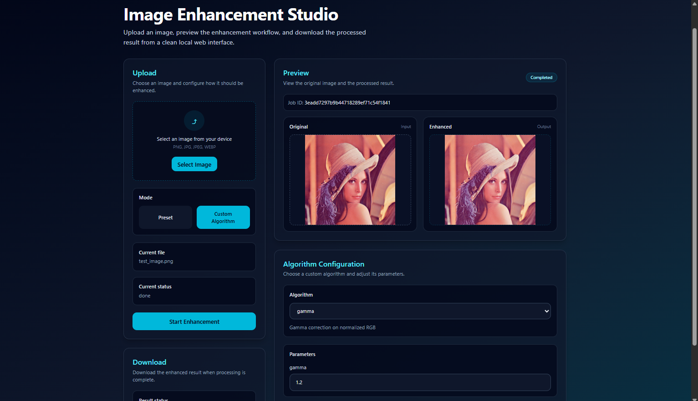

# Vision Enhance Platform

A local web-based image enhancement platform built with a **FastAPI backend** and a **React + TypeScript frontend**.

This project is designed as an **engineering-oriented image processing system** rather than a single script or notebook. It uses a **plugin-based pipeline architecture** so that enhancement algorithms can be added, composed, and tested in a clean, extensible way.

The current version supports both:

- **Preset enhancement pipelines** for quick processing
- **Custom single-algorithm configuration** with user-adjustable parameters

---

## Demo

### Preset Enhancement Mode

Users can choose from predefined enhancement pipelines for common image improvement tasks.



### Custom Algorithm Mode

Users can select an individual algorithm, adjust its parameters, and apply it as a custom enhancement workflow.




---

## Features

### Current End-to-End Workflow

- Upload an image from the local device
- Select a preset pipeline or switch to custom algorithm mode
- Send the processing request to the FastAPI backend
- Run enhancement through a pipeline-based execution engine
- Preview the processed result in the frontend
- Download the final output locally

### Preset Pipelines

The frontend supports ready-to-use enhancement presets, including:

- **Natural Enhance**
- **Low Light Enhance**
- **Detail Boost**

These presets are backed by predefined pipeline specifications in the backend.

### Custom Algorithm Mode

Users can manually choose a single enhancement algorithm and provide parameter values through the frontend UI.

Currently integrated algorithms include:

- Gamma Correction
- CLAHE
- Retinex (MSR on luminance)
- Bilateral Filter
- Unsharp Mask

### Backend Architecture

The backend is built around a modular processing system with:

- a unified internal image representation
- a plugin/registry pattern for algorithms
- declarative pipeline specifications
- workspace-based job execution and output storage

This design makes the project easier to extend with additional image enhancement methods, ML models, and domain-specific plugins in the future.

---

## Tech Stack

### Backend

- Python 3.11
- FastAPI
- Uvicorn
- NumPy
- OpenCV
- Pillow
- python-multipart

### Frontend

- React
- TypeScript
- Vite
- Tailwind CSS

---

## Project Structure

```text
vision-enhance-platform/
├── assets/                     # README screenshots and static demo images
├── src/
│   ├── backend/
│   │   ├── app/
│   │   │   ├── api/
│   │   │   ├── services/
│   │   │   ├── storage/
│   │   │   └── main.py
│   │   └── engine/
│   │       ├── core/
│   │       └── plugins/
│   └── frontend/
│       ├── src/
│       │   ├── components/
│       │   ├── services/
│       │   ├── App.tsx
│       │   └── main.tsx
│       └── package.json
├── workspaces/                 # generated job inputs/outputs/status files
├── .gitignore
├── LICENSE
└── README.md
```

---

## How It Works

The platform follows an engineering-style processing flow:

1. The frontend uploads an image to the backend.
2. The user either selects a **preset pipeline** or configures a **custom algorithm**.
3. The backend constructs the execution pipeline.
4. Each step processes the image through the registered plugin system.
5. The output is saved into a local workspace.
6. The frontend polls job status, previews the output, and enables downloading.

### Example Pipeline Specification

```json
[
  {
    "name": "gamma",
    "params": {
      "gamma": 1.2
    }
  },
  {
    "name": "clahe",
    "params": {
      "clip_limit": 2.0,
      "tile_grid_size": [8, 8]
    }
  }
]
```

---

## Installation

### 1. Clone the Repository

```bash
git clone https://github.com/JunhaoLiXD/vision-enhance-platform.git
cd vision-enhance-platform
```

### 2. Create and Activate a Python Environment

Using **conda**:

```bash
conda create -n vision-enhance python=3.11 -y
conda activate vision-enhance
```

Or using **venv**:

```bash
python -m venv .venv
```

On Windows:

```bash
.venv\Scripts\activate
```

On macOS / Linux:

```bash
source .venv/bin/activate
```

### 3. Install Backend Dependencies

If you already maintain a `requirements.txt`, run:

```bash
pip install -r requirements.txt
```

Otherwise, install the minimum required packages manually:

```bash
pip install fastapi uvicorn numpy opencv-python pillow python-multipart
```

### 4. Install Frontend Dependencies

```bash
cd src/frontend
npm install
```

---

## Running the Project Locally

This project is currently intended for **local development and demonstration**.

You need to run the backend and frontend separately.

### Start the Backend

From the project root:

```bash
uvicorn src.backend.app.main:app --reload
```

A successful backend startup usually runs on:

```text
http://127.0.0.1:8000
```

### Start the Frontend

Open a second terminal:

```bash
cd src/frontend
npm run dev
```

Vite will usually provide a local address such as:

```text
http://127.0.0.1:5173
```

Then open that address in your browser.

---

## Typical Usage

1. Start the backend server.
2. Start the frontend dev server.
3. Open the web UI in the browser.
4. Upload an image.
5. Choose either:
   - a preset pipeline, or
   - a custom algorithm with manual parameters
6. Start processing.
7. Wait for the output preview.
8. Download the enhanced result.

---

## API Overview

The backend currently includes routes such as:

- `POST /api/jobs` — create a processing job
- `GET /api/jobs/{id}` — query job status
- `GET /api/jobs/{id}/artifacts` — list generated output files
- `GET /api/jobs/{id}/download/{name}` — download an output image
- `GET /api/presets` — list available preset pipelines
- `GET /api/algorithms` — list available algorithms and parameter metadata

---

## Current Status

### Implemented

- FastAPI backend for image enhancement jobs
- React + TypeScript frontend
- Upload → process → preview → download workflow
- Preset pipeline selection in the UI
- Custom algorithm configuration panel in the UI
- Dynamic parameter inputs for supported algorithms
- Backend pipeline execution engine
- Workspace-based output management

### Planned / Future Work

- Multi-step custom pipeline builder
- Drag-and-drop pipeline UI
- ML-based enhancement models
- Better validation and parameter controls
- Docker support
- Astronomy-specific extension plugins (FITS workflows, calibration, specialized stretch)

---

## Why This Project

This project is intended to demonstrate more than just image processing algorithms. It also showcases:

- full-stack engineering with FastAPI and React
- modular backend architecture
- plugin-style extensibility
- pipeline-based task execution
- practical system design for computer vision applications

It is especially suitable as a portfolio project for software engineering, computer vision, and ML-related roles.

---

## Recommended Environment

For the smoothest local setup, use:

- Python 3.11
- Node.js 18+
- npm 9+

---

## Author

**Junhao Li**  
Computer Science @ University of Florida  
Interests: Computer Vision / Image Processing / Software Engineering
