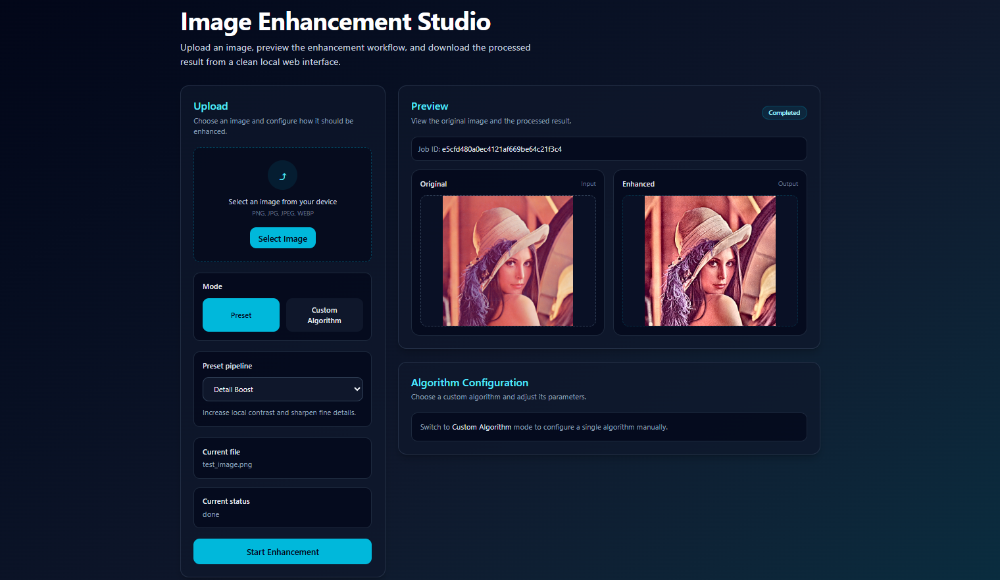
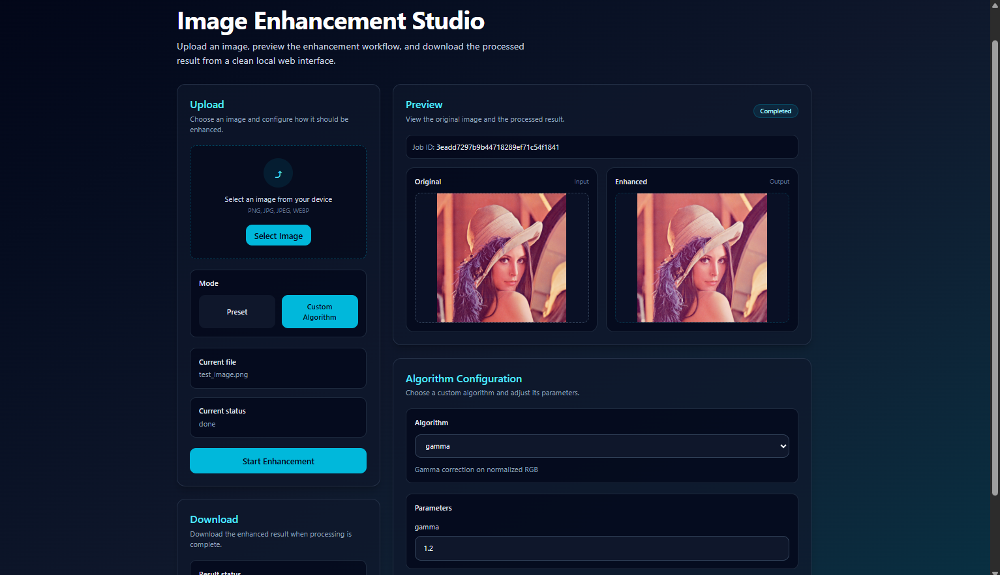

# Vision Enhance Platform

A full-stack image enhancement platform built with a **FastAPI backend** and a **React + TypeScript frontend**.

This project is designed as an **engineering-oriented image processing system** rather than a single script or notebook. It uses a **plugin-based pipeline architecture** so that enhancement algorithms can be added, composed, and tested in a clean, extensible way.

The current version supports:

- **Preset enhancement pipelines** — one-click processing with curated multi-step workflows
- **Custom Pipeline Builder** — compose and configure a multi-step enhancement pipeline manually, with per-step parameter control

---

## Live Demo

> **Frontend:** https://vision-enhance-platform.vercel.app/
>
> The backend is hosted on Render.com (free tier). The first request after a period of inactivity may take 30–60 seconds due to cold start. Subsequent requests respond normally.

---

## Demo

### Preset Enhancement Mode

Users can choose from predefined enhancement pipelines for common image improvement tasks.



### Custom Pipeline Builder

Users can compose a multi-step enhancement pipeline, choosing algorithms and adjusting parameters for each step independently.



> **Note:** The screenshot above may not reflect the latest UI. The custom mode now supports building a full multi-step pipeline rather than configuring a single algorithm.

---

## Features

### End-to-End Workflow

- Upload an image from the local device
- Select a preset pipeline or switch to Custom Pipeline Builder mode
- Send the processing request to the FastAPI backend (non-blocking — returns immediately)
- The backend runs the pipeline asynchronously; the frontend polls for completion
- Preview the original and enhanced images side by side
- Download the final output

### Preset Pipelines

| Preset | Description |
|--------|-------------|
| **Natural Enhance** | Balanced enhancement for general photos |
| **Low Light Enhance** | Boost visibility in underexposed images |
| **Detail Boost** | Increase local contrast and sharpen fine details |
| **Zero-DCE Enhance** | Low-light enhancement using the Zero-DCE neural network |

### Custom Pipeline Builder

Users can compose a custom multi-step pipeline from any combination of the available algorithms, configure parameters for each step, reorder steps, and remove steps — all from the frontend UI.

Available algorithms:

- **Gamma Correction** — brightness adjustment via power-law transform
- **CLAHE** — contrast-limited adaptive histogram equalization (LAB L channel)
- **Retinex MSR** — multi-scale Retinex illumination normalization (YCrCb Y channel)
- **Bilateral Filter** — edge-preserving denoising (YCrCb Y channel)
- **Unsharp Mask** — detail sharpening (YCrCb Y channel)

### Backend Architecture

The backend is built around a modular processing system with:

- a unified internal image representation (`ImageFrame`: float32 NumPy array in [0, 1])
- a plugin registry pattern — algorithms are self-describing via `params_schema` class attributes
- declarative pipeline specifications (JSON-serializable step lists)
- asynchronous job execution via FastAPI `BackgroundTasks`
- workspace-based job storage with status and manifest JSON files
- process-level model singleton — ML weights are loaded from disk only once per process

---

## Tech Stack

### Backend

- Python 3.11
- FastAPI + Uvicorn
- NumPy, OpenCV, Pillow
- PyTorch, TorchVision
- python-multipart

### Frontend

- React 19
- TypeScript
- Vite 8
- Tailwind CSS v4

---

## Project Structure

```text
vision-enhance-platform/
├── assets/                     # README screenshots
├── models/
│   └── zero_dce/
│       └── Epoch99.pth         # Zero-DCE pretrained weights
├── scripts/
│   └── test_zero_dce_local.py  # offline CLI test for Zero-DCE inference
├── src/
│   ├── backend/
│   │   ├── app/
│   │   │   ├── api/            # HTTP route definitions
│   │   │   ├── services/       # job orchestration, ML model manager
│   │   │   ├── storage/        # workspace filesystem management
│   │   │   └── main.py         # FastAPI app entry point
│   │   └── engine/
│   │       ├── core/           # ImageFrame, pipeline runner, presets, Step Protocol
│   │       └── plugins/        # classical and ML enhancement plugins, registry
│   └── frontend/
│       └── src/
│           ├── components/     # UploadPanel, PreviewPanel, DownloadPanel, AlgorithmConfigPanel
│           ├── services/       # typed API client
│           ├── App.tsx         # root component and state management
│           └── main.tsx        # React entry point
├── .gitignore
├── LICENSE
├── README.md
└── requirements.txt
```

---

## How It Works

```
User uploads image + selects preset or builds custom pipeline
  │
  ▼
POST /api/jobs  →  backend saves file, returns job_id immediately
                              │
                              ▼  (background thread)
                   ImageFrame → Pipeline → Step 1 → Step 2 → ... → Step N
                              │
                              ▼
                   Save output PNG → workspaces/{job_id}/output/
                   Write manifest.json + update status.json → "done"

Frontend polls GET /api/jobs/{id}  →  displays result  →  enables download
```

### Example Pipeline Specification

Pipelines are described as a JSON array of steps — the same format used internally and accepted by the API:

```json
[
  {
    "name": "bilateral_luma",
    "params": { "d": -1, "sigma_color": 0.06, "sigma_space": 3.0 }
  },
  {
    "name": "gamma",
    "params": { "gamma": 1.2 }
  },
  {
    "name": "clahe",
    "params": { "clip_limit": 2.0, "tile_grid_size": [8, 8] }
  }
]
```

---

## Installation

### 1. Clone the Repository

```bash
git clone https://github.com/JunhaoLiXD/vision-enhance-platform.git
cd vision-enhance-platform
```

### 2. Create and Activate a Python Environment

Using **conda**:

```bash
conda create -n vision-enhance python=3.11 -y
conda activate vision-enhance
```

Or using **venv** (Windows):

```bash
python -m venv .venv
.venv\Scripts\activate
```

Or using **venv** (macOS / Linux):

```bash
python -m venv .venv
source .venv/bin/activate
```

### 3. Install Backend Dependencies

```bash
pip install -r requirements.txt
```

### 4. Install Frontend Dependencies

```bash
cd src/frontend
npm install
```

---

## Running Locally

Two terminals are required.

### Terminal 1 — Backend

From the project root:

```bash
uvicorn src.backend.app.main:app --reload
```

The backend starts at `http://127.0.0.1:8000`.

### Terminal 2 — Frontend

On the first local run, create `src/frontend/.env.local` to point the frontend at the local backend instead of the deployed one:

```bash
# run from project root
echo "VITE_API_BASE_URL=http://localhost:8000" > src/frontend/.env.local
```

Then start the dev server:

```bash
cd src/frontend
npm run dev
```

Vite starts at `http://localhost:5173`. Open that address in your browser.

> **Why `.env.local`?** `src/frontend/.env` points to the deployed backend on Render.com. Vite gives `.env.local` higher priority, so local development uses the local backend while the deployed frontend continues to use the production backend. `.env.local` is gitignored and never committed.

---

## Typical Usage

1. Start the backend server.
2. Start the frontend dev server.
3. Open `http://localhost:5173` in your browser.
4. Upload an image (PNG, JPG, WEBP).
5. Choose a mode:
   - **Preset** — select a built-in pipeline from the dropdown
   - **Custom** — add steps one by one in the Pipeline Builder, adjust parameters per step
6. Click **Start Enhancement**.
7. Wait for the result preview to appear.
8. Click **Download Result** to save the output.

---

## API Overview

| Method | Endpoint | Description |
|--------|----------|-------------|
| `GET` | `/health` | Health check |
| `POST` | `/api/jobs` | Create a job (multipart: `file` + `preset_id` or `pipeline_spec_json`) |
| `GET` | `/api/jobs/{id}` | Query job status |
| `GET` | `/api/jobs/{id}/artifacts` | List output files for a job |
| `GET` | `/api/jobs/{id}/download/{name}` | Download an output file |
| `GET` | `/api/presets` | List available preset pipelines |
| `GET` | `/api/algorithms` | List available algorithms and their parameter schemas |

---

## Current Status

### Implemented

- FastAPI backend with async job processing
- React + TypeScript frontend
- Upload → process → preview → download end-to-end workflow
- Preset pipeline selection
- Custom multi-step Pipeline Builder with per-step parameter configuration and step reordering
- 5 classical image enhancement algorithms
- Zero-DCE deep learning low-light enhancement (PyTorch)
- Plugin registry with automatic algorithm schema generation
- Process-level model singleton (weights loaded once per process)
- Workspace-based job storage with status and manifest tracking

### Planned / Future Work

- Docker Compose packaging
- SQLite to replace JSON file storage (enables job history and querying)
- Workspace auto-cleanup (expire old jobs)
- Intermediate step preview (write to `preview/` directory)
- Drag-and-drop image upload
- Original / enhanced image slider comparison
- Astronomy-specific plugins (FITS file support, calibration workflows, specialized stretch algorithms)

---

## Why This Project

This project demonstrates more than image processing algorithms. It showcases:

- full-stack engineering with FastAPI and React
- modular, plugin-based backend architecture
- declarative pipeline design with runtime composability
- ML model integration with proper lifecycle management
- practical system design for computer vision applications

It is especially suitable as a portfolio project for software engineering, computer vision, and ML-related roles.

---

## Recommended Environment

- Python 3.11
- Node.js 18+
- npm 9+

---

## Author

**Junhao Li**  
Computer Science @ University of Florida  
Interests: Computer Vision / Image Processing / Software Engineering
